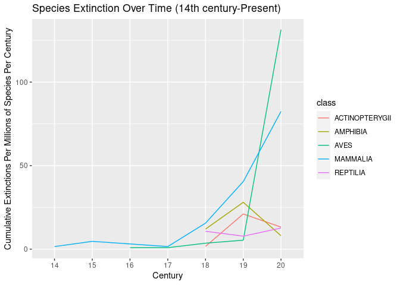

Extinctions Over Time
================
Caroline Wichterman, Megna Reddy

# Measuring The Rate of Extinction of IUCN RedList Species Over Time

Our aim with this project is to use the IUCN’s RedList API data to
analyze if extinction rates have increased over time and which species
were most affected.

The species we examined in this project were Mammalia, Aves, Amphibia,
Reptilia, and Actinopterygii. The Mammalia class represents vertebrate
animals that are mammals. Additionally, the Aves class represents the
birds population. The Amphibia class represents cold blooded vertebrates
and amphibians including frogs, toads, salamanders, and newts. The
Reptilia class includes four living clades: Crocodilia, Sphenodontia
(tautaras), Squamata (lizards and snakes), and Testudines (turtles).
Lastly, the Actinopterygii represents the Ray-finned fishes.

We hope to explore how each class has been affected by changes in
extinction rates and how species declines help assess the state of
global biodiversity. In order to ensure extinction rates do not
continuously rise, we must prioritize biodiversity conservation, reframe
global policy surrounding animal conservation, and take into account
ethical and aesthetic values of nature.

``` r
download.file("https://github.com/espm-157/extinction-template/releases/download/data2.0/extinction-data.zip", "extinction-data.zip")
unzip("extinction-data.zip")
```

``` r
base <- "https://apiv3.iucnredlist.org/api/v3"
endpoint <- "speciescount"
token <- "9bb4facb6d23f48efbf424bb05c0c1ef1cf6f468393bc745d42179ac4aca5fee"
url <- glue("{base}/{endpoint}?token={token}")

req <- GET(url)
x <- content(req)
x$speciescount
```

    [1] "150388"

``` r
species_endpoint <- "species"
page <- paste0("page/", 0:15)
all_pages <- glue("{base}/{species_endpoint}/{page}?token={token}")
```

``` r
if(!file.exists("all_species.rds")) {
  all_species <- map(all_pages, GET, .progress = TRUE)
  
  status <- map_int(all_species, status_code)
  stopifnot(all(status < 400))
  write_rds(all_species, "all_species.rds")
}
 all_species <- read_rds("all_species.rds")
```

``` r
all_resp <- map(all_species, content, encoding = "UTF-8")
```

``` r
sci_name <-
  map(all_resp, \(page) map_chr(page$result, "scientific_name")) |>
  list_c()

category <-
  map(all_resp, \(page) map_chr(page$result, "category")) |>
  list_c()

class <- 
  map(all_resp, \(page) map_chr(page$result, "class_name")) |>
  list_c()

all_species <- tibble(sci_name, category, class)
```

``` r
extinct_species <-
  all_species |>
  filter(category == "EX")
```

``` r
ext_sci_name <- extinct_species$sci_name
ex_urls <- glue("{base}/species/narrative/{ext_sci_name}?token={token}") |>
  URLencode()
```

``` r
if(!file.exists("ex_narrative.rds")) {
  ex_narrative <- map(ex_urls, GET,  .progress = TRUE)
  
  status <- map_int(ex_narrative, status_code)
  stopifnot(all(status < 400))
  
  write_rds(ex_narrative, "ex_narrative.rds")
}

ex_narrative <- read_rds("ex_narrative.rds")
```

``` r
narrative_contents <- map(ex_narrative, content)

narrative_population <- map(narrative_contents, 
                            \(x) map_chr(x$result[1], "population", .default = ""))

narrative_rationale <- map(narrative_contents, \(x) x$result[[1]]$rationale)
```

``` r
last_seen <- narrative_population |> 
  map_chr(str_extract, "\\d{4}") |> 
  as.integer()
```

``` r
extinction_dates <- 
  tibble(sci_name = ext_sci_name, last_seen) |> 
  distinct()

combined <- all_species |> left_join(extinction_dates)
```

    Joining with `by = join_by(sci_name)`

``` r
total_sp <- combined |> 
  filter(class %in% c("MAMMALIA", "AVES", "AMPHIBIA", "REPTILIA", "ACTINOPTERYGII")) |>
  count(class, name = "total")
total_sp
```

    # A tibble: 5 × 2
      class          total
      <chr>          <int>
    1 ACTINOPTERYGII 24223
    2 AMPHIBIA        7487
    3 AVES           11188
    4 MAMMALIA        6427
    5 REPTILIA       10283

``` r
final_tbl <- 
  combined |> 
  filter(category == "EX") |>
  filter(class %in% c("MAMMALIA", "AVES", "AMPHIBIA", "REPTILIA", "ACTINOPTERYGII")) |>
  mutate(last_seen = replace_na(last_seen, 2023),
         century =  str_extract(last_seen, "\\d{2}")) |>
  count(century, class) |> 
  left_join(total_sp) |>
  mutate(extinction_msy = n / total * 10000) # extinctions per million-species-years
```

    Joining with `by = join_by(class)`

``` r
 final_tbl 
```

    # A tibble: 20 × 5
       century class              n total extinction_msy
       <chr>   <chr>          <int> <int>          <dbl>
     1 14      MAMMALIA           1  6427          1.56 
     2 15      MAMMALIA           3  6427          4.67 
     3 16      AVES               1 11188          0.894
     4 17      AVES               1 11188          0.894
     5 17      MAMMALIA           1  6427          1.56 
     6 18      ACTINOPTERYGII     4 24223          1.65 
     7 18      AMPHIBIA           9  7487         12.0  
     8 18      AVES               4 11188          3.58 
     9 18      MAMMALIA          10  6427         15.6  
    10 18      REPTILIA          11 10283         10.7  
    11 19      ACTINOPTERYGII    51 24223         21.1  
    12 19      AMPHIBIA          21  7487         28.0  
    13 19      AVES               6 11188          5.36 
    14 19      MAMMALIA          26  6427         40.5  
    15 19      REPTILIA           8 10283          7.78 
    16 20      ACTINOPTERYGII    32 24223         13.2  
    17 20      AMPHIBIA           6  7487          8.01 
    18 20      AVES             147 11188        131.   
    19 20      MAMMALIA          53  6427         82.5  
    20 20      REPTILIA          13 10283         12.6  

## Background

- [Section Intro Video](https://youtu.be/QsH6ytm89GI)
- [Ceballos et al (2015)](http://doi.org/10.1126/sciadv.1400253)

Our focal task will be to reproduce the result from Ceballos and
colleagues showing the recent increase in extinction rates relative to
the background rate:


``` r
extinction_plot <-
  ggplot(data = final_tbl, aes(x=century, y=extinction_msy, group=class, color=class)) +
  geom_line() + labs(x = "Century", y = "Cumulative Extinctions Per Millions of Species Per Century", title = "Species Extinction Over Time (14th century-Present)")
extinction_plot
```

<!-- -->

## Extinctions Module

*Are we experiencing the sixth great extinction?*

### What is the current pace of extinction? Is it accelerating? How does it compare to background extinction rates?

The current pace of extinction is varied for the different species. The
pace of extinction of Mammalia (vertebrate animals that are mammals) is
on a steady, rapid increase from the 17th century on - representing an
extreme acceleration in the last 3 centuries. Similarly, the pace of the
Aves (birds) extinction is on an increase, however, much more extreme
than Mammalia. The rate of extinction skyrocketed from the 19th century
on, disrupting the mostly steady line of extinction from the 16th
century to the beginning of the 19th century. The Aves population has
seen the greatest extinction of all species measured in this plot. On a
much slower pace, the Reptilia population extinction is also on the rise
from the 19th century on. On the other hand, Actinopterygii (Ray-finned
species) and amphibia (cold blooded vertebrates and amphibians) species
are on a negative pace of extinction and are staying steady in
population size, potentially even increasing.

By looking at this plot and examining the data, it is clear that the
19th century was pivotal in the pace of extinction for all 5 species.
This correlates with the rate of expansion of the human population and
industrialization of our world to support a growing population, as
explored below.

The rising extinction rates of mammals, birds, and reptiles that is
shown above can be exacerbated by human-induced factors. In particular,
the rate of extinction skyrocketed for mammals and birds in the 19th
century which aligns with the impacts of the Industrial Revolution.
These classes of animals were exploited for utilitarian, monetary, and
diet purposes of humans across the world driving the accelerating
extinction rates. On the other hand, the ray-finned fishes and
amphibians have shown a decline in extinction which could be due to
their unique habitats and isolated ecosystems due to their lack of
services for humans.

After analyzing extinction over centuries, it is essential to our
well-being to prepare for future generations and prioritize biodiversity
conservation of all living things and organisms. In order to make
change, we must demonstrate a collaborative and focused effort across
the globe. This includes habitat conservation and restoration,
sustainable land development, anti-poaching measures, climate change
adaptation, and ongoing scientific research.

## Additional references:

- <http://www.hhmi.org/biointeractive/biodiversity-age-humans> (Video)
- [Barnosky et al. (2011)](http://doi.org/10.1038/nature09678)
- [Pimm et al (2014)](http://doi.org/10.1126/science.1246752)
- [Sandom et al (2014)](http://dx.doi.org/10.1098/rspb.2013.3254)
